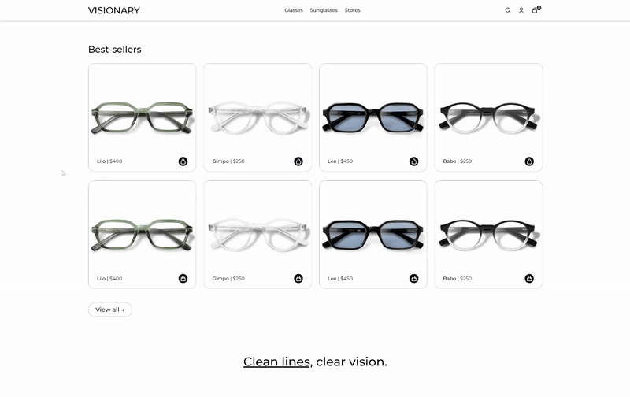

# Visionary

Visionary é um site e-commerce de óculos de grau e de sol, desenvolvido inteiramente em HTML, CSS e JavaScript puro, sem o uso de frameworks ou bibliotecas externas. O objetivo foi explorar e dominar o uso de JavaScript, criar uma experiência de compra fluida e otimizada para diferentes dispositivos, demonstrando domínio completo das tecnologias base do desenvolvimento web. 

  

### Servidor NodeJS + ExpressJS

Embora Visionary seja um projeto focado em front-end, a adoção do ambiente de desenvolvimento do NodeJS com ExpressJS seria estratégica pensando na realidade de um e-commerce completo, dinâmico e escalável. Apesar de não estar consumindo APIs, o NodeJS me permitiu criar um servidor leve e eficiente, além de oferecer uma melhor organização do projeto e o uso do ExpressJS, que foi fundamental para gerenciar requisições do usuário, como adicionar produtos ao carrinho. 
 
 

### UI/UX eficientes

Muitos sites de e-commerce pecam por navegação confusa e falta de foco na experiência do usuário. Para o site Visionary, adotei algumas medidas interessantes para solucionar esse problema:

• Estruturação clara do HTML com seções bem definidas para cada parte do site (Home, Produtos, Checkout, etc); 
• Implementação de menus responsivos e um sistema de navegação funcional utilizando JavaScript puro; 
• Simplicidade de navegação e descoberta de informações, mantendo a estética agradável e a organização clara.
 
 

### DOM Manipulation

Ao utilizar JavaScript puro, é comum que alguns recursos mais dinâmicos e sofisticados sejam deixados de lado. Por isso, para o site Visionary eu busquei:

• O uso inteligente da manipulação do DOM para abrir/fechar menus e sidecart; 
• Implementar filtros e seleção de categorias como 'óculos de grau' ou 'óculos de sol', controlando a renderização de produtos diretamente pelo JavaScript.

  

### Responsividade

• Utilização de CSS Flexbox e Grid para criar um layout adaptável a diferentes tamanhos de tela; 
• Estilização consistente com media queries, garantindo um design moderno e elegante tanto em desktop quanto mobile.
 
 

## Tecnologias:
   

          
